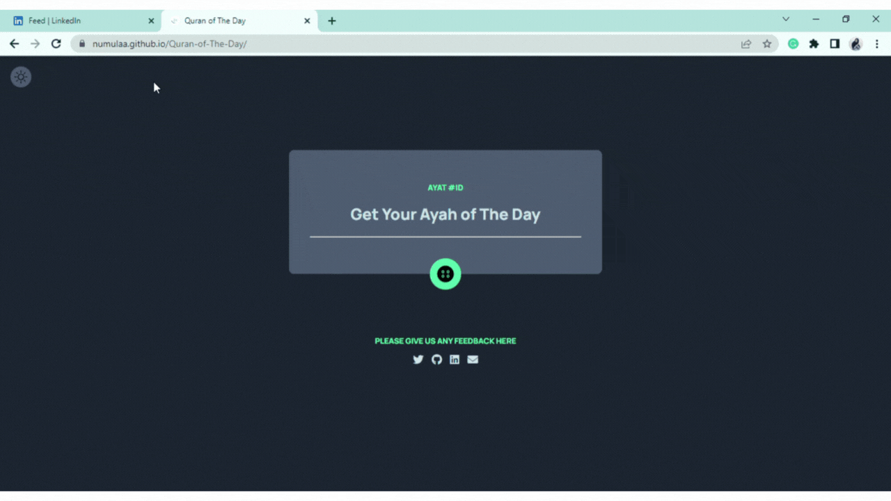

</img>

<h1 align="center">
   Hi, I am Nurul Mukhlisa
</h1>
<h3 align="center">Fullstack Web Developer</h3>

	

 
 
    
    
	

 

- 🌏 I am based in Indonesia
- 🌱 I’m currently playing around with React and Firebase
- 📫 How to reach me **nurulm.dev@gmail.com**
- ⚡ Fun fact I love [..., archery, shooting, gardening, baking, fishing] **I love drinking matcha latte while coding**

<h3 align="center">Languages and Tools:</h3>

  
  
  
  
 
  
 
  
  
 
 
	  

<!-- PROJECTS -->
<h1 align="center">Projects</h1>
<table bordercolor="#66b2b2">
  
  <tr>
    <td width="50%" valign="top">
      <h3 align="center">Quran of The Day</h3>
         
        
         
      

              
            	
        

    

          Frontend: HTML | CSS | JavaScript   
      An app to deliver daily dose of divine guidance.Each day, get a random Quranic ayah to inspire and nourish your soul.Whether you're seeking solace, motivation, or reflection, this app is designed to elevate your imaan (faith) with ease. Embrace the wisdom of the Quran and let its timeless teachings guide your daily journey.
        

    </td>
    <td width="50%" valign="top">
      <h3 align="center">DAPUR NENEK</h3>
         
      
         
        

              
            	
        

           

          Frontend: HTML | CSS | JavaScript  
          Backend: Node | Express | MongoDB   
      This is your social media site to share your grandma's secret recipes. Never forget how your grandma made it, share it with others, and discover more!
        

    </td>
  </tr>
<tr>
    <td width="50%" valign="top">
      <h3 align="center"Harry Potter Info Page & Game</h3>
         
        
         
        
 
     

              
            	
        

          

          Frontend: React | CSS  
         
      This is your social media site to share your grandma's secret recipes. Never forget how your grandma made it, share it with others, and discover more!
        

    </td>
	<td width="50%" valign="top">
      <h3 align="center">Portfolio</h3>
       
        
       
      

              
            	
        

            

          Frontend: HTML | CSS | JavaScript  
           
      This is your social media site to share your grandma's secret recipes. Never forget how your grandma made it, share it with others, and discover more!
        

    </td>
  </tr>

</table>

<!-- CODEWARS BADGE -->

  

