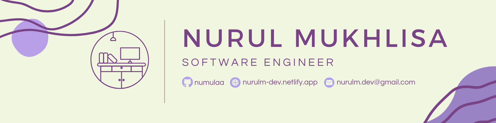

</img>

<h1 align="center">
   Hi, I am Nurul Mukhlisa
</h1>
<h3 align="center">Fullstack Web Developer based in Indonesia</h3>

	

 
 
    
    
	

- 🌱 I’m currently learning **MERN**

- 📫 How to reach me **nurulm.dev@gmail.com**

- ⚡ Fun fact **I love drinking matcha latte while coding**

<h3 align="center">Skills:</h3>

         

<h3 align="center">Connect with me:</h3>

  
  
  
  
  

<!-- PROJECTS -->
<h1 align="center">Projects</h1>
<table bordercolor="#66b2b2">
  
  <tr>
    <td width="50%" valign="top">
      <h3 align="center">Quran of The Day</h3>
         
        
         
        

          
    
  
      

        
<strong>Javascript, HTML, CSS</strong> - DESCRIPTION COMING SOON

    </td>
    <td width="50%" valign="top">
      <h3 align="center">DAPUR NENEK</h3>
         
      
         
        

          
  
  
      

        
<strong>HTML5, CSS3, Javascript & Howler.js </strong>- DESCRIPTION COMING SOON

    </td>
  </tr>
<tr>
    <td width="50%" valign="top">
      <h3 align="center"Harry Potter Info Page & Game</h3>
         
        
         
        

          
  
    
        
Harry Potter Info Page & Game

    </td>
	<td width="50%" valign="top">
      <h3 align="center">Portfolio</h3>
       
        
       
        

  
  
      

        
<strong>HTML5, CSS3, & Javascript</strong> - My portfolio Site includes links to my projects, and ways to contact me.

    </td>
  </tr>

</table>

<!-- CODEWARS BADGE -->

  

&nbsp;

